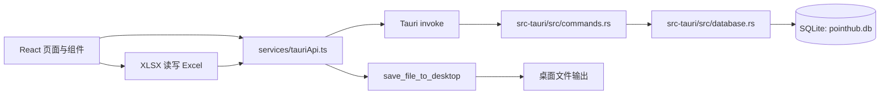

# 系统架构设计

## 1. 产品定位

PointHub（积分豆）用于班级场景下的“积分化激励管理”，核心目标是让老师能够：

- 维护班级与学生信息。
- 快速给学生加减积分。
- 维护班级商城商品。
- 让学生按积分兑换商品并记录履约（发货）状态。
- 通过 Excel 批量导入/导出减少录入成本。

## 2. 技术架构概览

- 前端：React 19 + TypeScript + React Router + Tailwind CSS 4 + Vite
- 桌面容器：Tauri 2
- 后端：Rust（Tauri Commands）
- 数据库：SQLite（rusqlite，bundled）

## 3. 代码分层

### 3.1 前端层（`src/`）

- 路由入口
  - `src/main.tsx`
  - `src/routes.tsx`
- 页面层（业务编排）
  - `src/pages/ClassManagement.tsx`
  - `src/pages/ClassStudents.tsx`
  - `src/pages/ClassProducts.tsx`
  - `src/pages/ClassShopPage.tsx`
- 组件层（可复用 UI + 交互单元）
  - 班级、学生、商品、商城、兑换、分页、确认框、Toast、动画等
- API 适配层
  - `src/services/tauriApi.ts`（invoke 封装）
- 类型层
  - `src/types/index.ts`

### 3.2 Tauri/Rust 层（`src-tauri/src/`）

- 应用启动与 command 注册
  - `lib.rs`, `main.rs`
- command 门面层
  - `commands.rs`（参数接收、调用 database、错误字符串化）
- 数据持久层
  - `database.rs`（建表、迁移、CRUD、事务）
- 数据模型层
  - `models.rs`（请求/响应结构）

## 4. 运行时数据流

### 4.1 班级管理流

1. 页面调用 `classApi.getAll()`。
2. `invoke('get_classes')` -> `commands::get_classes` -> `database.get_all_classes()`。
3. 返回列表后渲染 `ClassCard`。
4. 新增/编辑/删除流程同理，完成后前端重拉数据。

### 4.2 学生积分流

1. `ClassStudents` 载入班级信息 + 学生列表。
2. 点击加减分后前端先乐观更新状态。
3. 调用 `studentApi.update(id, { points })`。
4. 后端更新成功则保持，失败则回滚并 Toast 报错。

### 4.3 商城兑换流

1. `ClassShop` 加载商品，点击商品触发 `ExchangeModal`。
2. 弹窗加载同班学生，选择学生和数量。
3. 调用 `purchaseApi.create(productId, studentId, quantity)`。
4. 后端事务中执行：库存校验 -> 积分校验 -> 写购买记录 -> 扣积分 -> 扣库存。
5. 前端成功后刷新商品数据，历史页通过分页接口展示记录并可更新发货状态。

## 5. 模块依赖与耦合点

### 5.1 低耦合部分

- `tauriApi.ts` 统一了前端与后端通信入口。
- `Confirm`、`Toast`、`Pagination` 等通用组件与业务页面分离。

### 5.2 高耦合部分

- 页面内包含较多业务逻辑与 UI 逻辑（尤其 `ClassStudents`、`ClassProducts`）。
- Excel 导入/导出逻辑直接写在页面组件中，未下沉到 service/usecase。
- 后端数据库层单文件（`database.rs`）体量较大，承载迁移 + CRUD + 事务。

## 6. 关键设计决策（现状）

- 使用 SQLite 本地文件存储，强调离线可用与部署简易。
- 使用 Tauri command 作为唯一本地 RPC 通道，不引入 HTTP server。
- 前端以页面局部 state 为主，不引入全局状态库。
- Excel 处理在前端完成解析/生成，再通过 Tauri 写文件到桌面。

## 7. 非功能特征

- 性能：当前数据量下可用；大量导入时为串行写入，吞吐有限。
- 可维护性：中等；页面大文件与数据库大文件提升维护成本。
- 可扩展性：中等；domain 边界清晰，但缺少 service/usecase 抽象层。
- 兼容性：桌面应用（Tauri），配置中目标以 Windows NSIS 为主。

## 8. 架构风险摘要

- 数据完整性约束较弱（数据库层缺少明确唯一约束/索引/外键强制策略声明）。
- 前端多处乐观更新与本地状态计算，存在局部显示与真实数据短暂不一致风险。
- 核心业务逻辑分散在大页面内，新增需求易引入回归。

