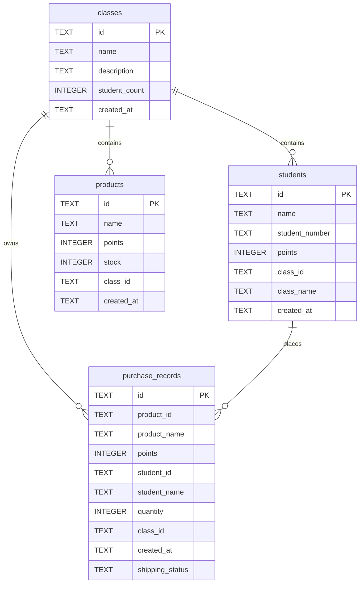

# 数据模型与数据库设计

## 1. 存储位置与初始化

- 数据库文件名：`pointhub.db`
- 初始化入口：`src-tauri/src/database.rs::Database::new`
- 数据目录选择策略（按顺序尝试）：
  - `D:\PointHub`
  - `E:\PointHub`
  - `F:\PointHub`
  - `app_handle.path().app_data_dir()`
- 若目录不存在会自动创建。

## 2. 实体关系（ER）

## 3. 表结构

### 3.1 `classes`

- 主键：`id TEXT`
- 字段：
  - `name TEXT NOT NULL`
  - `description TEXT`
  - `student_count INTEGER NOT NULL DEFAULT 0`
  - `created_at TEXT NOT NULL`（RFC3339 字符串）

### 3.2 `students`

- 主键：`id TEXT`
- 字段：
  - `name TEXT NOT NULL`
  - `student_number TEXT NOT NULL DEFAULT ''`
  - `points INTEGER NOT NULL DEFAULT 0`
  - `class_id TEXT NOT NULL`
  - `class_name TEXT NOT NULL`
  - `created_at TEXT NOT NULL`

### 3.3 `products`

- 主键：`id TEXT`
- 字段：
  - `name TEXT NOT NULL`
  - `points INTEGER NOT NULL`
  - `stock INTEGER NOT NULL`
  - `class_id TEXT NOT NULL`
  - `created_at TEXT NOT NULL`

### 3.4 `purchase_records`

- 主键：`id TEXT`
- 字段：
  - `product_id TEXT NOT NULL`
  - `product_name TEXT NOT NULL`
  - `points INTEGER NOT NULL`（当前记录总积分）
  - `student_id TEXT NOT NULL`
  - `student_name TEXT NOT NULL`
  - `quantity INTEGER NOT NULL`
  - `class_id TEXT NOT NULL`
  - `created_at TEXT NOT NULL`
  - `shipping_status TEXT NOT NULL DEFAULT 'pending'`

## 4. 数据迁移与兼容逻辑

初始化阶段包含若干“幂等迁移”策略：

- 尝试给 `students` 表新增 `created_at` 列。
- 尝试给 `students` 表新增 `student_number` 列。
- 回填历史空值：
  - `created_at` 为空则填当前时间。
  - `student_number` 为空则根据 `id` 生成默认值。
- 尝试给 `purchase_records` 新增 `shipping_status` 列。
- 若检测到旧 `purchase_records` schema 仍含 `product_id` 外键约束，则重建表迁移数据。

## 5. 事务与一致性

### 5.1 购买事务

`create_purchase_record` 的核心顺序：

1. `BEGIN TRANSACTION`
2. 查询商品和学生
3. 校验库存充足
4. 校验积分充足
5. 插入购买记录
6. 扣减学生积分
7. 扣减商品库存
8. `COMMIT`

失败时执行 `ROLLBACK` 并返回错误。

### 5.2 学生计数维护

- 新增学生：更新班级 `student_count`。
- 删除学生：更新班级 `student_count`。
- 学生换班：更新旧班级与新班级 `student_count`。

## 6. 默认数据

首次启动且 `classes` 为空时，会写入：

- 示例班级：`计算机科学与技术2021级1班`
- 示例学生：`张三`（学号 `2021001`，积分 `85`）

## 7. 已观察到的数据层注意点

- 当前代码未创建显式索引，分页与筛选性能主要依赖数据量较小前提。
- `student_number` 无唯一约束，同班重复学号目前可写入。
- `points`/`stock` 无检查约束（可写入负值，前端有部分限制但数据库层无硬约束）。
- 删除班级时只显式删除学生，商品/购买记录清理依赖数据库约束与配置策略（当前代码未显式统一声明外键强制策略）。

## 8. 建议后续演进方向

- 增加关键索引：
  - `students(class_id, student_number)`
  - `products(class_id, created_at)`
  - `purchase_records(class_id, created_at)`
- 增加唯一约束：`students(class_id, student_number)`。
- 增加检查约束：`points >= 0`, `stock >= 0`, `quantity > 0`。
- 明确并统一外键策略（`PRAGMA foreign_keys = ON` + 级联策略）。

