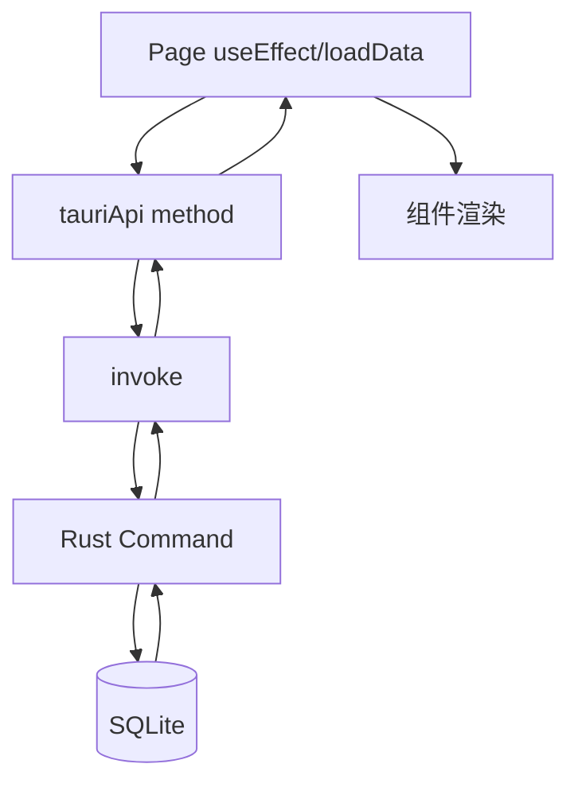

# 前端模块设计

## 1. 目录职责

- `src/main.tsx`：React 挂载与 RouterProvider 注入。
- `src/routes.tsx`：路由表定义。
- `src/pages/`：按页面编排业务流程。
- `src/components/`：可复用 UI 与局部交互。
- `src/services/tauriApi.ts`：后端调用门面。
- `src/types/index.ts`：前端域模型类型声明。

## 2. 路由到页面映射

- `/` -> `ClassManagement`
- `/class/:classId/students` -> `ClassStudents`
- `/class/:classId/products` -> `ClassProducts`
- `/class/:classId/shop` -> `ClassShopPage`（内部渲染 `ClassShop`）

## 3. 页面职责边界

### 3.1 `ClassManagement`

- 负责班级列表、班级 CRUD。
- 可直接切换到“班级商城嵌入视图”（非路由方式）。
- 使用组件：`ClassCard`、`ClassModal`、`Confirm`、`ToastContainer`。

### 3.2 `ClassStudents`

- 班级学生管理核心页面。
- 覆盖学生 CRUD、积分快捷操作、排序搜索、随机点名、Excel 导入导出。
- 使用组件：`SimpleStudentModal`、`RandomCallModal`、`FallingAnimation`、`Confirm`、`ToastContainer`。

### 3.3 `ClassProducts`

- 班级商品管理核心页面。
- 覆盖商品 CRUD、搜索、Excel 导入、模板下载。
- 内置 `ProductModal`（页面内声明）。

### 3.4 `ClassShopPage` + `ClassShop`

- 商城购买入口。
- `ClassShopPage` 负责 route 参数与班级加载。
- `ClassShop` 负责商品展示、兑换弹窗、购物记录视图切换。

## 4. 核心组件说明

### 4.1 通用组件

- `Confirm` + `useConfirm`：危险操作二次确认。
- `Toast` + `ToastContainer` + `useToast`：操作反馈消息。
- `Pagination`：分页导航与统计信息。

### 4.2 业务组件

- `ClassCard`：班级卡片。
- `ProductCard`：商品卡片（状态标签 + 管理按钮 + 兑换按钮）。
- `ExchangeModal`：购买确认与学生选择。
- `PurchaseHistoryList`：购物记录分页列表与发货状态更新。
- `SimpleStudentModal`：学生编辑弹窗（当前实际使用版本）。
- `StudentModal`：备用学生弹窗（当前未在页面中使用）。

### 4.3 视觉交互组件

- `FallingAnimation`：加分/减分反馈动画（星星/爆炸图标）。
- `RandomCallModal`：随机点名抽取展示。

## 5. 状态管理模式

- 以页面级 `useState` 为主，不使用全局状态库。
- 数据刷新策略：
  - CRUD 成功后通常调用 `loadData()` 全量重拉。
  - 少量操作采用乐观更新（积分、发货）。
- 弹窗状态模式：`isOpen` + `editingEntity`。

## 6. 前端数据流图

## 7. 样式体系

- `src/index.css` 仅引入 `tailwindcss`。
- 样式几乎全部写在 JSX className 中（utility-first）。
- 视觉风格偏渐变、卡片化、强调色标签与状态动效。

## 8. 交互体验设计（现状）

- 加载态：多数页面有全屏/区块 Loading。
- 空态：列表为空时有提示与引导按钮。
- 危险操作：统一弹确认框。
- 操作反馈：多数页面有 Toast 成功/失败提示。
- 分页：购买记录页采用服务端分页。

## 9. 前端层风险点

- 页面体积较大（尤其 `ClassStudents`、`ClassProducts`），后续改动回归成本高。
- 业务逻辑和 UI 耦合较深，复用困难。
- 部分组件存在“定义但未使用”情形，容易造成理解歧义。

## 10. 建议重构方向

- 把页面逻辑拆为 hooks：
  - `useClassStudentsPage`
  - `useClassProductsPage`
  - `usePurchaseHistory`
- 提炼导入/导出流程到独立 `services/excel.ts`。
- 统一建立 `api-error` 解析器，减少每页重复错误处理模板代码。

